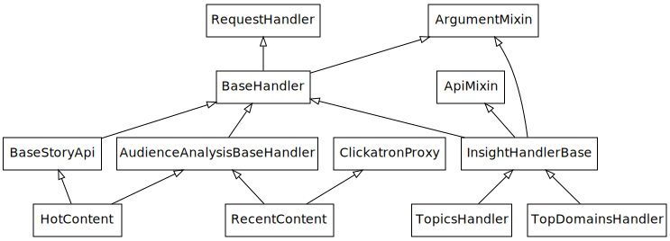
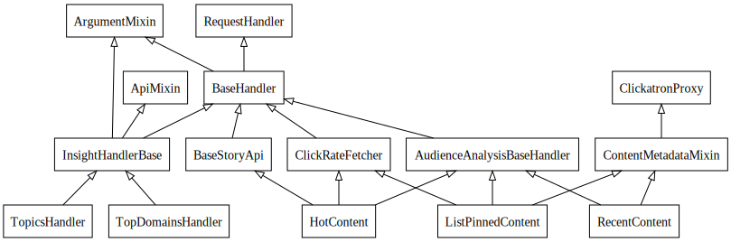
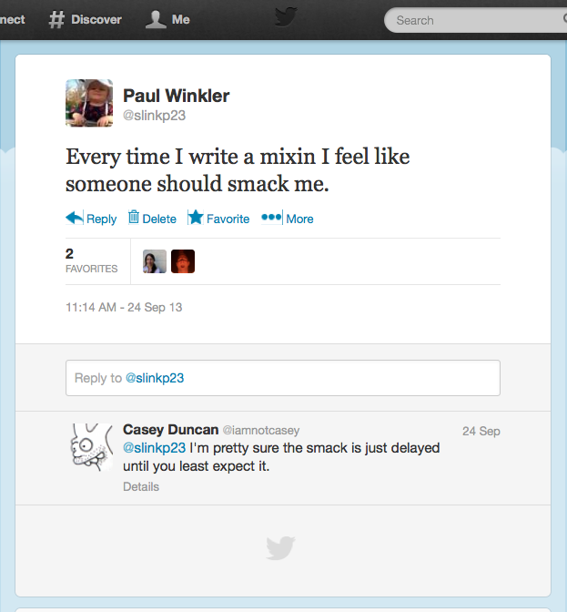
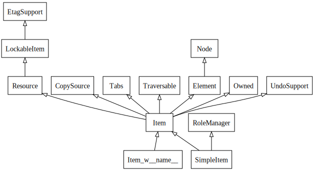
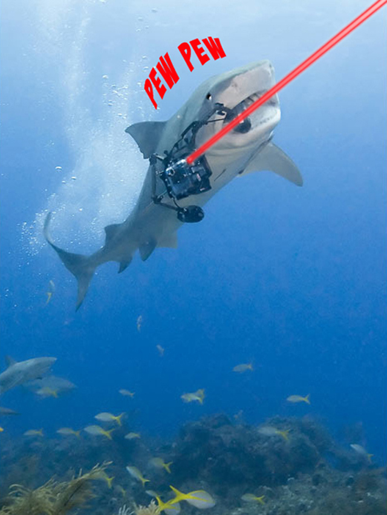
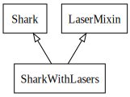
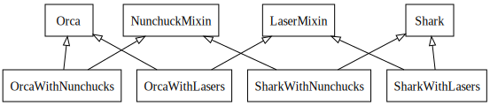
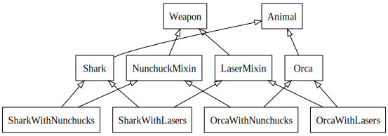
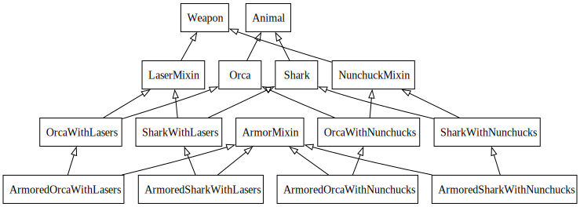
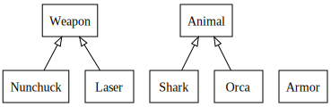

:css: static/style.css

:data-transition-duration: 1500

.. title:: incremental non-design

=========================
Incremental (non-) Design
=========================

 .. image:: static/cute-collapsing-towers-animation.gif 

Paul Winkler
@percolate

revised 2014-06-20 for PyGotham proposal

----

Intro / Disclaimer
=====================

.. note::

  There's some fairly beginner-level OO design tips here.
  Some of you know all of this. Some of you know more than me about all of
  this.  Some of you may disagree with me about all of this.  Some of you have
  probably never heard any of this and may learn something. Wanted to share
  my observations and opinions and hopefully we'll all (including me) learn
  something.

----

Thesis
------

Inheritance is powerful but easily overused.

Inheritance, overused, is bad design with real negative consequences.

Inheritance overuse is easy to do without intention.
(In fact, almost inevitable.)

We all do it, let's think about it and stop.

----

Backstory
============

Recently I was working on some rest API endpoints for my employer.

Needed to add an endpoint, and reuse some existing features.

Solution: Factored out methods into a new shared base class
(actually a mixin).

There were already other base classes, some shared and some not.
Factored out shared features into two mixins.

.. note::
  Question for audience: does everybody know what a mixin is? in python?

----

Problem solved! Go home.
========================

----

I started with this...

----

I ended up with this...

----

https://twitter.com/slinkp23/status/382568693466935296

----

Confession
===============

Hi, my name is Paul, and I'm a recovering Zope 2 programmer.

Perhaps this makes me overly sensitive?

----

So I should know better.

(*part* of the inheritance tree of the ironically named SimpleItem)

----

A "Worst Practice": Incremental Non-Design
-------------------------------------------

Default OO design: big inheritance chain.
(Single or multiple.)

Default refactoring:  Make moar base classes!

Result: Big complex inheritance graph grows and grows.

It's not just me.

----

What should we do instead?

----

"Favor Composition Over Inheritance"
------------------------------------

"Has-a" or "Uses-a" relationships, instead of "Is-a".

Underlying principle in "Design Patterns" (aka the "Gang of Four" book)

----

BUT WHY?
========

.. note::

   What's bad about inheritance and what's good about composition?

----

Symptoms of Inheritance Overuse
--------------------------------

* Class Explosion

* "Yo-yo" problem

* Poor Separation of Concerns

Let's explain these by example.

----

Contrived Example:
------------------

I just want a freakin' shark with lasers.

.. code:: python

    shark_with_lasers.attack(target)

.. .. image:: static/f2eb_shark_w_frickin_laser_pointer.jpg
..   :width: 400px

----

Bad implementation
--------------------
.. code:: python

    class SharkWithLasers(Shark, LaserMixin):
    
        def attack(self, target):
            self.shoot(target)
            self.eat(target)

----

This is easy, right?

But now we want an orca with nunchaku.

----

----

Hmm, there's some commonalities we can factor into
base classes...

----

And now we want to allow them to wear armor.

----

----

.. :data-rotate: 180

:data-x: r0
:data-y: 2500
:data-z: 4000
:data-rotate-x: 90
:data-rotate-z: 90

Class explosion.
================

----

:data-rotate: 0
:data-x: r0
:data-y: r0
:data-z: 0
:data-rotate-x: 180
:data-rotate-z: 180

Every concept we add makes more and more classes.

But even if we never do, it's already bad, because...

----

:data-rotate: 0
:data-x: r2000
:data-y: r2000
:data-z: r0
:data-rotate-x: 0
:data-rotate-z: 0

Yo-yo problem
===============

:data-y: r0

https://en.wikipedia.org/wiki/Yo-yo_problem

  "Often we get the feeling of riding a yoyo when we
  try to understand one [of] these message trees."
  -- Taenzer, Ganti, and Podar, 1989

.. note::

  With inheritance, when you look at a method call, the place where
  that method is defined is implicit.
  Same with attribute assignments.
  If you want to know where it's defined, you have to go hunting for it.
  When self.foo() calls self.bar() calls self.baz() calls self.fleem()
  and each of those could be defined in any or all of 20 inherited classes,
  you find yourself bouncing up and down through the inheritance tree
  looking for these method definitions. If any are overridden,
  you have to also reconstruct Python's method resolution order
  in your head, or find a tool to do it for you.
  Put another way: when you see "self", you don't know if it currently
  means a shark, or a base Animal, or a thing with lasers, or a base
  Weapon, or a thing with armor?  You have to look all over, with only
  the names to give you clues.

----

:data-y: r1000
:data-x: r0

Yo-yo problem larval stage
===========================

It starts innocuously enough...

.. code:: python

    class SharkWithLasers(SharkBase, LaserMixin):

        def attack(self, target):
            self.shoot(target)
            self.eat(target)

Where are shoot() and eat() defined?
-------------------------------------

----

:data-y: r-2000
:data-x: r0

Okay, easy in that example.

.. code:: python
    
    class Shark(object):
        def eat(self, target):
            print "chomp! delicious %s" % target
    
    class LaserMixin(object):
        def shoot(self, target):
            print "pew! pew! at %s" % target

Not so much when there are dozens of classes.

----

:data-y: r3000
:data-x: r0

Imagine that:

- you don't have the diagram, just code.

- methods are overriden in various places throughout this graph

- Who is "self"?

----

:data-y: r-4000
:data-x: r0

Single inheritance is somewhat easier...
========================================

.. note::

  Your poor brain only has to bounce up and down in the class chain,
  not all over a class graph.

But it's still bad.

----

:data-y: r5000
:data-x: r0

Poor Separation of Concerns
=============================

ArmoredSharkWithLasers will have methods related to sharks, lasers, and armor.

Those are not conceptually related at all.

More classes + more methods = more yo-yo

----

:data-y: r-6000
:data-x: r2000

But that's all contrived!
===========================

Yes, it's a bad made-up design that nobody would ever do.

(right?)

----

:data-y: r0
:data-x: r2000

Overuse of Inheritance & Mixins - Examples in the Wild
==========================================================

 - Zope 2 - OFS.Item
 - Django "Generic" views
 - DjangoRestFramework - early versions
 - a bunch of things I wrote, eg. OpenBlock scraper mini-framework

----

.. .. image:: static/shareabouts.dot.svg
..    :width: 1200px
..
.. ----

None of this is news.  Why do we all still overuse inheritance?
---------------------------------------------------------------

- OO 101: Falls out of any language with inheritance

- D.R.Y. encourages quick easy refactoring

- Reuse via adding more base classes is almost always
  obvious and easy.

- Alternatives may not be as intuitive or obvious.

- Once you pop, you can't stop

----

Possibly Controversial Opinion: Mixins are bad more often than good.
--------------------------------------------------------------------

----

Mixins are good...
--------------------

- mixins are good because each base class does one thing
- convenient because you can combine these base classes to get
  different combinations of behavior.

----

BUT mixins are bad...
------------------------

- multiple inheritance gone bananas.
- easy to assemble lego-style iff you understand the classes
  and how they interact.
- internal interactions get VERY complex
- very hard to understand if you don't.
- very hard to debug a concrete class made by someone else, or by yourself last month
- python 2 does not give us many tools to talk about contracts, so you really have to read every line to understand what the implicit contract is. What can I mix this into?

----

... not always bad
------------------

Some characteristics of nice mixins:

- does one thing, or only a couple very closely related things
- unlikely to need to use it polymorphically / override its methods

----

"Favor Composition Over Inheritance" again

----

Composition: Usually Better
------------------------------

.. code:: python

    class Shark(object):
        def __init__(self, weapon):
            self.weapon = weapon

        def eat(self, target):
            print "chomp! delicious %s" % target

        def attack(self, target):
            self.weapon.attack(target)
            self.eat(target)

    shark_with_laser = Shark(weapon=Laser())

----

Better: Fewer Classes
---------------------

----

Better:  Separation of Concerns
---------------------------------------------------------

- "self.weapon" namespace is a nice bundling of related functionality

----

Better: Less Yo-yo Problem
--------------------------------------

.. code:: python

        def attack(self, target):
            self.weapon.attack(target)
            #    ^^^^^^  A clue!
            self.eat(target)
            # Still have to look, but the tree is smaller.

.. note::

  - If needed, one-line wrapper methods can be added to Shark or a subclass, and these internally are nice and explicit. (Be mindful of the "law of demeter")

----

Better: More expressive too
----------------------------

These would have been hard to do without special case hacks
and/or yet more classes:
 
.. code:: python

    mystery_shark = Shark(
        weapon=get_random_weapon_somehow())

    armed_to_the_teeth = Shark(
        weapon=WeaponCollection(Lasers(), Grenades()))

----

Back to the backstory...
=========================

Audience Analysis:

Two different views / handlers need to show click rates.

 - I would prefer them to *have* a ClickRateFetcher, not *be* a
   ClickRateFetcher, since that's orthogonal to serving a request.

 - but I need to get the info from an external service...

 - access to this service is already provided via ClickServiceProxy
   which depends on being mixed in to the view.

----

Choices:

   1. write my a new click service client that isn't a mixin (ugh)

   2. or, the ClickRateFetcher and the Handler can refer to and call each other

   3. or suck it up and put the ClickRateFetcher in the inheritance graph

----

When I run out of time, I do the easiest thing - just inherit.

Remember the title of this talk?

Incremental Non-Design.

----

Untangling is hard
===================

Why does the ClickServiceProxy need to *be* a request handler anyway?

Maybe it doesn't.  Or shouldn't.

But it calls various methods and properties of other base Handler classes, so
there's a lot of inertia.

.. note::

  So existing inheritance hierarchy tends to encourage more inheritance,
  because it's easier than puzzling out how to do without it.

  Next time I'll try the reference (option 2).

----

Discussion? Q&A?
=================

References / Inspiration / Shamelessly Stolen
---------------------------------------------

* "End of Object Inheritance" talk, PyCon 2013
  - Video http://pyvideo.org/video/1684/
  - slides unfortunately not readable alone, really should watch it.

* "API Design for Library Authors" - Chris McDonough's talk @ PyCon 2013
  - Video http://pyvideo.org/video/1705/api-design-for-library-authors
  - Slides https://speakerdeck.com/pyconslides/api-design-for-libraries-by-chris-mcdonough
  - Relevant takeaway: Don't make your users inherit from your classes.
  - introduced me to "yoyo problem".

* "Composability Through Multiple Inheritance" - opposing view, also PyCon 2013. https://us.pycon.org/2013/schedule/presentation/110/

