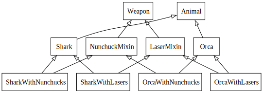
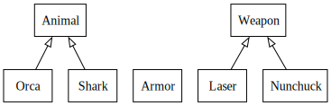
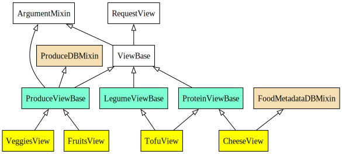

:css: static/style.css

:data-transition-duration: 1500

.. title:: incremental non-design

=========================
Incremental (non-) Design
=========================

Fighting Entropy like Sisyphus!

 ..
    .. image:: static/cute-collapsing-towers-animation.gif 

Paul Winkler
@percolate

revised for PyGotham 2014

.. note::

  Hi. I'm Paul Winkler and I'm here to talk about object-oriented software
  design.

  I work here in NY at Percolate, there are a bunch of us here today
  and yes we are hiring... we have a booth, come talk to us if you're
  looking for work.  We're a PyGotham gold sponsor as well!

  TODO percolate logos

----

Intro: What is this talk and who is it for?
===========================================

* how things accidentally get worse

* one basic principle of design

* the process of refactoring

.. note::

  A bit about this talk.

  There's some fairly beginner-level OO design tips here;
  there's also some waxing philosophical so I hope the more experienced
  people won't be bored.

  I'm going to talk about:  (see slide)

  Some of you know all of this. Some of you know more than me about all of
  this.  Some of you may disagree with me about this. I wanted to share my
  experiences and opinions and hopefully all of us (including me) will learn
  something. Some of you may know none of this and are waiting for me to
  explain what the hell I'm talking about.

  First, to get a sense of who's here today - show of hands:

  Who here would call themselves pretty experienced at OO design?

  Who here is just starting at OO programming or design?

  Out of curiosity, anybody here who came to Python after starting out in
  languages that aren't, or at least aren't typically, programmed using classes
  and inheritance?  (eg. Javascript, PHP)?

  Anybody who learned Python *specifically* so they could do Django or Flask?

  (The interesting thing about that for my purposes is that I've noticed
  it's possible to do quite a bit of productive work in Django without
  ever doing much OO design. Which is actually pretty cool. But it
  might leave you wondering what all this OO design fuss is about.)

----

Background: Emergent Design
============================

In agile processes, we often avoid prolonged design.
Instead:

1. Build the simplest thing possible

2. Refactor

3. Repeat

Result: Always the simplest design possible!

.. note::

  In my career: Most software I've worked on is developed using some agile
  approach and deployed on the web frequently. There are no big
  releases, just a constant stream of improvements.

  Q: How many people work in similar situations?

  In this world, it's taken as gospel truth that the old big-design-up-front
  approaches are bad because you don't know enough up front to predict
  *what* you need to design, so you waste time *and* you design the wrong
  thing.  I believe this is largely true, though I reject the extreme of
  thinking you should start without doing any preliminary design work at all.

  Instead we have embraced as a best practice the mantra: refactor
  constantly. Do the simplest thing and always be improving your design and all
  will be well.

----

Thesis: Emergent design doesn't always emerge
===============================================

Result: Big ball of mud!

.. image:: http://media.trb.com/media/photo/2012-10/73033205.jpg

(source: CBS via Baltimore Sun)

.. note::

  Unfortunately, I'm going to argue, we often do a poor job of this.  And a
  good design fails to emerge.  What emerges instead is often very messy.  The
  proverbial "Big Ball of Mud" design. And this happens not through any one bad
  decision but through a series of decisions that in isolation make good sense,
  but taken together add up to an overly complex software design.

  And I'm going to say up front that there's no grand solution here.
  The solution is vigilance and being aware of the pitfalls.

----

"We must imagine Sisyphus happy"
==================================

 .. image:: static/whsyh0b.gif
    :width: 500px

(this title is from Camus)

.. note::

  Hence, Sisyphus. We are never going to be done pushing the design rock up the
  hill. Or the kitten up the slide.  Eternal vigilance is the price of, not
  just liberty, but also agile design.

----

Try to enjoy it!
====================

 .. image:: static/sisyphus_happy_excerpt.png

from http://existentialcomics.com/comic/29

.. note::

  If that doesn't appeal to you, you might be in the wrong line of work...
  or need an attitude change.  Savor the little victories. Always be learning.

----

How do things get worse?
========================

For today, focusing on overuse of inheritance.

.. note::

  This talk could go on forever so I'm picking on my favorite target.
  Inheritance. Or more specifically, overuse of inheritance for things
  that can be done more flexibly and more simply in other ways.

----

Inheritance
-------------

Powerful!

Inheritance, overused, is bad design with real negative consequences.

Overuse is easy to do without intention.
(almost inevitable?)

We all do it, let's think about it and stop.

XXX TODO 2-class graph

----

A "Worst Practice": Incremental Non-Design
-------------------------------------------

Default OO design: big inheritance chain.
(Single or multiple.)

Default refactoring:  Make moar base classes!

Default design pattern: Template Method

Result: Big complex inheritance graph grows and grows.

It's not just me.

.. note::

  Things we do by default as we incrementally improve a system.
  These are all often highly expedient and often make things worse.

----

Confession
===============

Hi, my name is Paul, and I'm a recovering Zope 2 programmer.

Perhaps this makes me overly sensitive?

.. note::

   Zope, for the young folks in the audience, was a web development
   framework that was very big in the Python world around 10-15 years
   ago. Internally it used multiple inheritance very very heavily,
   so when you wanted to write extensions for it, you had to inherit from
   everything on the planet and override various methods.

----

Zope 2 in a nutshell:

.. image:: static/classes_ofs_item.dot.svg

.. note::

   *part* of the inheritance tree of the ironically named SimpleItem.

   Nearly everything you did in Zope 2 involved inheriting from this class.
   There were a bunch of other classes that didn't make it into this graph
   because of some magic that confused the inspection tool I was using.

----

https://twitter.com/slinkp23/status/382568693466935296

.. note::

   So, people with my history are typically very suspicious of big inheritance
   graphs. Not coincidentally, the guy that replied to me is also a recovering
   Zope 2 programmer.

----

Why is this bad? And what should we do instead?
------------------------------------------------

Hint: "Favor Composition Over Inheritance"

.. note::

  I'm going to show a simple contrived example, and then a real-world example
  of the kinds of problems I'm talking about.

  I'm going to show you why they're problems.

  I'm going to show you an alternative you may have heard of.
  How many people have heard the phrase "Favor composition over
  inheritance"?  How many have not?

  TODO: I'm going to walk you through actually doing it.

----

BUT WHY?
========

.. note::

   What's bad about inheritance and what's good about composition?

----

Symptoms of Inheritance Overuse
--------------------------------

* Class Explosion

* "Yo-yo" problem

* Poor Separation of Concerns (tight coupling)

* Implicit Contract Everywhere (low cohesion)

Let's explain these by example.

----

Contrived Example:
------------------

Your client just wants a freakin' shark with lasers.

.. code:: python

    shark_with_lasers.attack(target)

----

Quick and Easy...
--------------------
.. code:: python

    class SharkWithLasers(Shark, LaserMixin):
    
        def attack(self, target):
            self.shoot(target)
            self.eat(target)

.. image:: static/shark_inherit_1.py.dot.svg
   :width: 400px

----

Problem solved! Go home.
========================

This is easy, right?

.. image:: static/problem_solved.gif
   :width: 800px

.. note::

   TODO: possible to restart the animation when we hit this page??

----

But now we want an orca with nunchaku.

----

.. image:: static/shark_inherit_1a.py.dot.svg
   :width: 1000px

----

Hmm, there's some commonalities we can factor into
base classes...

----

And now we want to allow them to wear armor.

----

----

.. :data-rotate: 180

:data-x: r0
:data-y: 2500
:data-z: 4000
:data-rotate-x: 90
:data-rotate-z: 90

.. image:: static/explosion.gif
   :height: 600px

Class explosion.
================

----

:data-rotate: 0
:data-x: r0
:data-y: r0
:data-z: 0
:data-rotate-x: 180
:data-rotate-z: 180

Every concept we add makes more and more classes.

But even if we stop here forever, it's already bad, because...

----

:data-rotate: 0
:data-x: r2000
:data-y: r2000
:data-z: r0
:data-rotate-x: 0
:data-rotate-z: 0

Yo-yo problem
===============

:data-y: r0

https://en.wikipedia.org/wiki/Yo-yo_problem

  "Often we get the feeling of riding a yoyo when we
  try to understand one [of] these message trees."
  -- Taenzer, Ganti, and Podar, 1989

.. note::

  With inheritance, when you look at a method call, the place where
  that method is defined is implicit.
  Same with attribute assignments.
  If you want to know where it's defined, you have to go hunting for it.
  When self.foo() calls self.bar() calls self.baz() calls self.fleem()
  and each of those could be defined in any or all of 20 inherited classes,
  you find yourself bouncing up and down through the inheritance tree
  looking for these method definitions. If any are overridden,
  you have to also reconstruct Python's method resolution order
  in your head, or find a tool to do it for you.
  Put another way: when you see "self", you don't know if it currently
  means a shark, or a base Animal, or a thing with lasers, or a base
  Weapon, or a thing with armor?  You have to look all over, with only
  the names to give you clues.

----

:data-y: r1000
:data-x: r0

Yo-yo problem larval stage
===========================

It starts innocuously enough...

.. code:: python

    class SharkWithLasers(SharkBase, LaserMixin):

        def attack(self, target):
            self.shoot(target)
            self.eat(target)

Where are shoot() and eat() defined?
-------------------------------------

----

:data-y: r-2000
:data-x: r0

Okay, easy in that example.

.. code:: python
    
    class Shark(object):
        def eat(self, target):
            print "chomp! delicious %s" % target
    
    class LaserMixin(object):
        def shoot(self, target):
            print "pew! pew! at %s" % target

Not so much when there are dozens of classes.

.. note::

  Imagine that:

  - you don't have the diagram, just code.

  - methods are overriden in various places throughout this graph

----

:data-y: r3000
:data-x: r0

Who is "self"?

.. note::

  It's interesting to ask yourself in each method definition,
  what kind of object do I mean when I say "self"?
  Implicitly it could rely on any combination of behaviors or states
  supported by any of the base classes.

----

:data-y: r-4000
:data-x: r0

Single inheritance is somewhat easier...
========================================

.. note::

  Your poor brain only has to bounce up and down in the class chain,
  not all over a class graph.

But it's still bad.

----

:data-y: r5000
:data-x: r0

Poor Separation of Concerns
=============================

`ArmoredSharkWithLasers` will have methods related to sharks, lasers, and armor.

Those are not conceptually related at all.

More classes + more methods = more yo-yo

----

:data-y: r-6000
:data-x: r2000

"Favor Composition Over Inheritance"
------------------------------------

"Has-a" or "Uses-a" relationships, instead of "Is-a".

Underlying principle in "Design Patterns" (aka "Gang of Four" book)

.. note::

  Now we get back to this phrase we mentioned before.

----

Composition: Usually Better
------------------------------

.. code:: python

    class Shark(object):
        def __init__(self, weapon):
            self.weapon = weapon

        def eat(self, target):
            print "chomp! delicious %s" % target

        def attack(self, target):
            self.weapon.attack(target)
            self.eat(target)

    shark_with_laser = Shark(weapon=Laser())

----

Better: Fewer Classes
---------------------

----

Better:  Separation of Concerns
---------------------------------------------------------

- "self.weapon" namespace is a nice bundling of related functionality

----

Better: Less Yo-yo Problem
--------------------------------------

.. code:: python

        def attack(self, target):
            self.weapon.attack(target)
            #    ^^^^^^  A clue!
            self.eat(target)
            # Still have to look, but the tree is smaller.

.. note::

  - If needed, one-line wrapper methods can be added to Shark or a subclass, and these internally are nice and explicit. (Be mindful of the "law of demeter")

----

Better: More flexible too
----------------------------

These would have been hard to do without special case hacks
and/or yet more classes:
 
.. code:: python

    mystery_shark = Shark(
        weapon=get_random_weapon())

    armed_to_the_teeth = Shark(
        weapon=WeaponCollection(Lasers(), Grenades()))

----

But that's all contrived!
===========================

Yes, it's a bad made-up design that nobody would ever do.

(right?)

----

:data-y: r0
:data-x: r2000

..
   Overuse of Inheritance & Mixins - Examples in the Wild
   ==========================================================

    - Zope 2 - OFS.Item
    - Django "Generic" views
    - a bunch of things I wrote, eg. OpenBlock scraper mini-framework

   ----

.. .. image:: static/shareabouts.dot.svg
..    :width: 1200px
..
.. ----

A real-world story
====================

* Existing REST API

* Needed to add an endpoint

* New endpoint needed to reuse behavior

* Existing API was built as a class hierarchy

.. note::

  One day I was working on some rest API endpoints at my job.

----

I started with this...

.. note::

   Names of classes changed to protect the innocent. But this was
   generated from a real system.

----

Solution: Factored out methods into two new shared base classes
(used as mixins).

.. image:: static/aa_final.dot.svg
   :width: 1000px

.. note:: TODO: maybe show an alternate design where we have-a fetcher
   instead of is-a fetcher?
   And gradually do that to the whole graph?

----

None of this is news.  Why do we all still overuse inheritance?
---------------------------------------------------------------

TODO is this slide wholly redundant?

- OO 101: Falls out of any language with inheritance

- D.R.Y. encourages quick easy refactoring

- Easiest path to reuse: Add more base classes!

- Alternatives may not be as intuitive or obvious.

- Once you pop, you can't stop

----

Back to the story...
=========================

TODO rewrite this to match slides!!

Audience Analysis:

Two different views / handlers need to show click rates.

 - I would prefer them to *have* a ClickRateFetcher, not *be* a
   ClickRateFetcher, since that's orthogonal to serving a request.

 - but I need to get the info from an external service...

 - access to this service is already provided via ClickServiceProxy
   which depends on being mixed in to the view.

----

Choices:

   1. the ClickRateFetcher and the Handler can refer to and call each other
      (2-way references) ... breaks the inheritance dependency, but
      not much cleaner.

   2. write a new click service client that isn't a mixin and doesn't know
      about the Handler at all.  Harder.  (#1 is a good transitional step)

   3. or suck it up and leave the ClickRateFetcher in the inheritance graph

----

When I run out of time, I do the easiest thing - just inherit.

Remember the title of this talk?

Incremental Non-Design.

----

Untangling is hard
===================

Why does the ClickServiceProxy need to *be* a request handler anyway?

Maybe it doesn't.  Or shouldn't.

But it calls various methods and properties of other base Handler classes, so
there's a lot of inertia.

.. note::

  So existing inheritance hierarchy tends to encourage more inheritance,
  because it's easier than puzzling out how to do without it.
  This is what I meant by "once you pop, you can't stop."

  Next time I'll try the reference (option 2).

  TODO: DO THE DARN THING

----

Possibly Controversial Opinion: Mixins usually suck
---------------------------------------------------

.. note::
  Question for audience: does everybody know what a mixin is? in python?

  (If not: A mixin is a class designed not to be used by itself, but by
  inheriting from it to add some behavior to your class.  Get more behavior by
  inheriting from more mixins.  In some languages eg. Ruby, this means
  something a bit more formal, but in python it's just an informal idea
  of, here's a class you can inherit from if you want its behavior.)

----

Mixins are good...
--------------------

- mixins are good because each base class does one thing
- reuse is easy - just inherit from the relevant class
- different combinations of these base classes to give different combinations
  of behavior.

----

BUT mixins are bad...
------------------------

- multiple inheritance gone bananas.
- easy to *assemble* lego-style iff you understand the classes
  and how they interact.
- very hard to *understand* if you don't.
- internal interactions get VERY complex
- hard to debug a concrete class made by someone else, or by yourself last month
- python 2 does not give us many tools to talk about contracts, so you really have to read every line to understand what the implicit contract is. What can I mix this into?

----

... not always bad
------------------

Some characteristics of nice mixins:

- does one thing, or only a couple very closely related things
- unlikely to need to use it polymorphically / override its methods

----

Possibly Controversial Opinion #2: "Template Method" pattern sucks
----------------------------------------------------------------------

TODO: Why it sucks?

Symptom: reuse is tied very tightly to the inheritance tree and is very hard to
refactor away from that tree.

Symptom: As that tree grows, you don't have a yo-yo problem anymore, you have a
pinball problem:

TODO can't find decent pinball gif
maybe convert this somehow??
https://vine.co/v/M2vKeePb2TQ

Good simple example: unittest.TestCase.
The setUp() and tearDown() are expected to be overridden.
Good because:
* Shallow inheritance - you often just inherit TestCase directly and done
* Optional - you can omit either/both
* Few hooks - only two!
* No state to worry about (except whatever *you* add)

So template method is certainly not *bad*, it's useful and good.
Some code smells to watch out for:

- Lots of hooks: hard to remember / understand
- Order of operations is not obvious from hook names
- Base class implementations depend on state ...
  that means there's more implicit contract than just method calls
  in some order, you also have to understand and maintain that state.
- Many base classes. Especially if you're inheriting from more than one
  Template Method-style base class with different sets of hooks - RUN AWAY

----

Questions?
=================

References / Inspiration / Shamelessly Stolen
---------------------------------------------

* "End of Object Inheritance" talk, PyCon 2013
  - Video http://pyvideo.org/video/1684/
  - slides unfortunately not readable alone, really should watch it.

* "API Design for Library Authors" - Chris McDonough's talk @ PyCon 2013
  - Video http://pyvideo.org/video/1705/api-design-for-library-authors
  - Slides https://speakerdeck.com/pyconslides/api-design-for-libraries-by-chris-mcdonough
  - Relevant takeaway: Don't make your users inherit from your classes.
  - introduced me to "yoyo problem".

* "Composability Through Multiple Inheritance" - opposing view, also PyCon 2013. https://us.pycon.org/2013/schedule/presentation/110/

* Cats-on-a-slide gif: found at
  http://thisconjecture.com/2014/02/15/the-myth-of-sisyphus-a-touch-of-silly-and-a-great-animation-of-the-story/
  original provenance unclear.

* TODO: Design Patterns Explained

----

Dumping Ground
=======================

Eclipse plugin that does automatically replace inheritance -> comp or
delegation: http://www.fernuni-hagen.de/ps/prjs/RIWD/

Tools:

 pylint (pyreverse)
 graphviz (dot)
