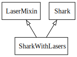
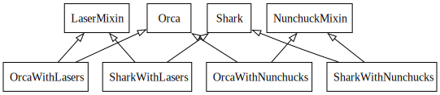
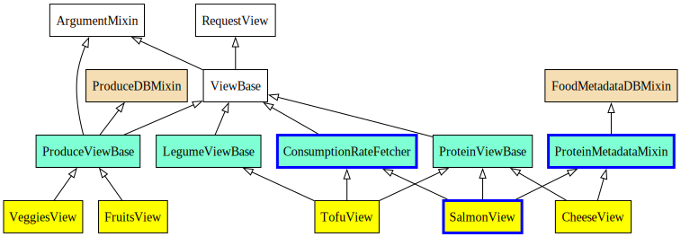

:css: static/style.css

:data-transition-duration: 700

.. title:: incremental non-design

=========================
Incremental (non-) Design
=========================

Fighting Entropy like Sisyphus!

 ..
    .. image:: static/cute-collapsing-towers-animation.gif 

paul.winkler@percolate.com

revised for PyGotham 2014

.. note::

  Hi. I'm Paul Winkler and I'm here to talk about object-oriented software
  design.

  I work here in NY at Percolate, there are a bunch of us here today
  and yes we are hiring...
  We're a PyGotham gold sponsor as well!
  we have a booth in the food area, come talk to us if you're looking
  for work or just curious what we do.

----

Intro: What is this talk?
===========================================

* Entropy: how things accidentally get worse over time

* one basic principle of design: *favor composition over inheritance*

* the process of refactoring

.. note::

  There's some fairly beginner-level OO design tips here;
  there's also some waxing philosophical so I hope the more experienced
  people won't be bored.

  I'm going to talk about 3 things ... (slide)

  Some of you know all of this. Some of you know more than me about all of
  this.  Some of you may disagree with me about this. Some of you may
  know none of this.

  First, to get a sense of who's here today - show of hands:

  Who here would call themselves pretty experienced at OO design?

  Who here is just starting at OO programming or design?

  Out of curiosity, anybody here who came to Python after starting out in
  languages that aren't, or at least aren't typically, programmed using classes
  and inheritance?  (eg. Javascript, PHP)?

  Anybody who learned Python *specifically* so they could do Django or Flask?

  (The interesting thing about that for my purposes is that I've noticed
  it's possible to do quite a bit of productive work in Django without
  ever doing much OO design. Which is actually pretty cool. But it
  might leave you wondering what all this OO design fuss is about.)

----

Background: Emergent Design
============================

Agile mantra:

1. Build the simplest thing possible

2. Refactor

3. Repeat

.. note::

  In my career: Most software I've worked on is developed using some agile
  approach and deployed on the web frequently. There are no big
  releases, just a constant stream of improvements.

  Q: How many people work in similar situations?

  In this world, it's taken as gospel truth that the old big-design-up-front
  approaches are bad because you don't know enough up front to predict
  *what* you need to design, so you waste time *and* you design the wrong
  thing.  I believe this is largely true, though I reject the extreme of
  thinking you should start without doing any preliminary design work at all.

  Instead we have embraced as a best practice the mantra: refactor
  constantly. Do the simplest thing and always be improving your design and all
  will be well.

----

Thesis: Emergent design doesn't always emerge
===============================================

Result: Big ball of mud!

*(source: CBS via Baltimore Sun)*

.. note::

  Unfortunately, I'm going to argue, we often do a poor job of this.  And a
  good design fails to emerge.  Instead, we often get the proverbial "Big Ball
  of Mud" design. And this happens not through any one bad decision but through
  a series of decisions that in isolation make good sense, but taken together
  add up to an overly complex software design.

  And I'm going to say up front that there's no grand solution here.
  The solution is vigilance and being aware of the pitfalls.

----

"We must imagine Sisyphus happy"
==================================

"The struggle itself ... is enough to fill a man's heart". -- Camus

 .. image:: static/whsyh0b.gif
    :width: 500px

.. note::

  Hence, Sisyphus. We are never going to be done pushing the design rock up the
  hill. Or the kitten up the slide.  Eternal vigilance is the price of, not
  just liberty, but also agile design.

  Disclaimer: I have not read Camus. I can use the google.

----

Try to enjoy it!
====================

 .. image:: static/sisyphus_happy_excerpt.png

from http://existentialcomics.com/comic/29

.. note::

  If that doesn't appeal to you, you might be in the wrong line of work...
  or need an attitude change.  Savor the little victories. Always be learning.

----

How do things get worse?
========================

For today, focusing on overuse of inheritance.

.. note::

  This talk could go on forever so I'm picking on my favorite target.
  Inheritance. Or more specifically, overuse of inheritance for things
  that can be done more flexibly and more simply in other ways.

----

Why do we over-use inheritance?
-----------------------------------------------

Bad defaults:

* Default design: big inheritance graph.

* Default refactoring:  moar base classes!

* Default design pattern: Template Method

Hard to untangle.

.. note::

  Things we do by default as we incrementally improve a system.
  These are all often highly expedient and often make things worse.

  OO 101: Over-inheritance falls out of any language with inheritance.

  Easiest path to D.R.Y.: Add more base classes!

  Alternatives may not be as intuitive or obvious.

   We continue to overuse inheritance because it's a path of very low
   resistance.  And once we have an existing system that uses inheritance,
   it's very difficult - perhaps prohibitively so - to stop doing that.
   Once you pop, you can't stop!

----

Zope 2 in a nutshell:

.. image:: static/classes_ofs_item.dot.svg

.. note::

   Confession: Hi, my name is Paul, and I'm a recovering Zope 2 programmer.

   Perhaps this makes me overly sensitive?

   Zope, for the young folks in the audience, was a web development
   framework that was very big in the Python world around 10-15 years
   ago. Internally it used multiple inheritance very very heavily.

   Here's *part* of the inheritance tree of the ironically named SimpleItem.
   Nearly everything you did in Zope 2 involved inheriting from this class.

   Easy things were usually easy. The hard things it made convenient were
   easy. Anything else was rough going.

----

.. image:: static/tweet.png

https://twitter.com/slinkp23/status/382568693466935296

.. note::

   So, people with my history are typically very suspicious of big inheritance
   graphs. Not coincidentally, the guy that replied to this tweet of mine
   is also a recovering Zope 2 programmer.

----

Why is too much inheritance bad?
--------------------------------

.. note::

  I'm going to show a simple contrived example, and a real-world example
  of the kinds of problems I'm talking about.

  I'm going to show you why they're problems, show you 3 or 4 common symptoms
  of overuse.

  And what should we do instead?

  I'm going to show you an alternative you may have heard of.
  How many people have heard the phrase "Favor composition over
  inheritance"?  How many have not?

  I'm going to briefly walk you through actually doing it.

----

Contrived Example: Requirements
---------------------------------

.. code:: python

    shark_with_lasers.attack(target)

.. image:: static/shark-stealing-a-camera-lasers_01.jpg
   :width: 400px

.. note::

  Your client just wants a freakin' shark with lasers.

----

Quick and Easy...
--------------------
.. code:: python

    class SharkWithLasers(Shark, LaserMixin):
    
        def attack(self, target):
            self.shoot(target)
            self.eat(target)

----

Problem solved! Go home.
========================

This is easy, right?

----

New Requirement
================

.. note::

   But now we want an orca with nunchaku.

----

----

Factor out commonalities into more base classes...

.. image:: static/shark_inherit_2.py.dot.svg
   :width: 1000px

----

Another requirement!
====================

----

.. image:: static/shark_inherit_3.py.dot.svg

Uh-oh.

----

.. :data-rotate: 180

:data-x: r0
:data-y: 2500
:data-z: 40000
:data-rotate-x: 90
:data-rotate-z: 90

.. image:: static/explosion.gif
   :height: 600px

Symptom 1: Class explosion.
===========================

----

:data-rotate: 0
:data-x: r0
:data-y: r0
:data-z: 0
:data-rotate-x: 180
:data-rotate-z: 180

Every concept we add makes more and more classes.

But even if we stop here forever, it's already bad, because...

----

:data-rotate: 0
:data-x: r2000
:data-y: r2000
:data-z: r0
:data-rotate-x: 0
:data-rotate-z: 0

Symptom 2: Yo-yo problem
==========================

:data-y: r0

https://en.wikipedia.org/wiki/Yo-yo_problem

  "Often we get the feeling of riding a yoyo when we
  try to understand one [of] these message trees."
  -- Taenzer, Ganti, and Podar, 1989

.. note::

  With inheritance, when you see a method being called, and
  you want to understand what's going on,
  you have to mentally envision the inheritance graph and
  figure out which class defines the version that's actually getting called.

  Since subclasses can call methods defined in superclasses, and superclasses
  can also call methods that overridden or even only defined in subclasses,
  you have to go hunting by bouncing up and down through the inheritance tree
  looking for these method definitions.

  Your development tools like IDEs and language servers can do the grunt
  work for you of course, but that doesn't mean you can _understand_
  the design, or that it's any good.

  Understanding state - instance state, typically via attribute assignments -
  is even worse, because it can change on literally any line.

  Multiple inheritance makes it even more fun - it's not like being a yo-yo,
  it's like being a pinball and bouncing all over the place.
  You have to reconstruct Python's method resolution order
  in your head, or find a tool to do it for you.

----

:data-y: r1000
:data-x: r0

Yo-yo problem larval stage
===========================

.. code:: python

    class SharkWithLasers(SharkBase, LaserMixin):

        def attack(self, target):
            self.shoot(target)
            self.eat(target)

Where are shoot() and eat() defined?
-------------------------------------

.. note::

  It starts innocuously enough...

----

:data-y: r-2000
:data-x: r0

Easy to guess in that example.

.. code:: python
    
    class Shark(object):
        def eat(self, target):
            print "chomp! delicious %s" % target
    
    class LaserMixin(object):
        def shoot(self, target):
            print "pew! pew! at %s" % target

Not so much when there are dozens of classes.

----

:data-y: r3000
:data-x: r0

Who is "self"?

.. note::

  Put another way: It's interesting to ask yourself in each method definition,
  what kind of object do I mean when I say "self"?

  You don't know if it currently means a shark, or a base Animal, or a thing
  with lasers, or a base Weapon, or a thing with armor?  You have to look all
  over, with only the names to give you clues.

----

:data-y: r5000
:data-x: r0

Symptom 3: Poor Separation of Concerns
==========================================

`ArmoredSharkWithLasers` will have methods related to sharks, lasers, and armor.

Those are not conceptually related at all.

More classes + more methods = more yo-yo

----

:data-y: r0
:data-x: r2000

"Favor Composition Over Inheritance"
------------------------------------

"Has-a" or "Uses-a" relationships, instead of "Is-a".

Underlying principle in "Design Patterns" (aka "Gang of Four" book)

.. note::

  Now we get back to this phrase we mentioned before.

----

Composition: Usually Better
------------------------------

.. code:: python

    class Shark(object):
        def __init__(self, weapon):
            self.weapon = weapon

        def eat(self, target):
            print "chomp! delicious %s" % target

        def attack(self, target):
            self.weapon.attack(target)
            self.eat(target)

    shark_with_laser = Shark(weapon=Laser())

----

Better: Fewer Classes
---------------------

.. image:: static/shark_composition_3.py.dot.svg

----

Better:  Separation of Concerns
---------------------------------------------------------

- "self.weapon" namespace is a nice bundling of related functionality

----

Better: Less Yo-yo Problem
--------------------------------------

.. code:: python

        def attack(self, target):
            self.weapon.attack(target)
            #    ^^^^^^  A clue!
            self.eat(target)
            # Still have to look, but the tree is smaller.

.. note::

  - If needed, one-line wrapper methods can be added to Shark or a subclass, and these internally are nice and explicit. (Be mindful of the "law of demeter")

----

Better: More flexible too
----------------------------

These would have been hard to do without special case hacks
and/or yet more classes:
 
.. code:: python

    mystery_shark = Shark(
        weapon=get_random_weapon())

    armed_to_the_teeth = Shark(
        weapon=WeaponCollection(Lasers(), Grenades()))

----

But that's all contrived!
===========================

Yes, it's a bad made-up design that nobody would ever do.

(right?)

----

:data-y: r0
:data-x: r2000

..
   Overuse of Inheritance & Mixins - Examples in the Wild
   ==========================================================

    - Zope 2 - OFS.Item
    - Django "Generic" views
    - a bunch of things I wrote, eg. OpenBlock scraper mini-framework

   ----

.. .. image:: static/shareabouts.dot.svg
..    :width: 1200px
..
.. ----

A real-world story
====================

* Existing REST API

* Needed to add an endpoint

* New endpoint needed to reuse behavior

* Existing API was built as a class hierarchy

.. note::

  One day I was working on some rest API endpoints at my job.

----

Started with...

.. image:: static/aa_start.dot.svg
   :width: 800px

.. note::

   Names of classes changed to protect the innocent. But this
   was generated from real code from a real production system.

----

:id: center1

Solution...

.. note::

     Existing inheritance hierarchy tends to encourage more inheritance,
     because it's easier than puzzling out how to do without it.
     This is what I meant by "once you pop, you can't stop."

     Here I factored out methods I needed to re-use into two new base
     classes.

----

..
   If you only do the easiest thing ...

   And don't refactor...

   If you don't improve the design as you go...

   That's incremental non-design.

   .. image:: static/mud_car.jpg
      :height: 400px

   ----

..
   Getting out of the mud is hard
   =================================

   Why does the ProteinMetadata class need to *be* a request handler anyway?

   Maybe it doesn't.  Or shouldn't.

   But it calls various methods and properties inherited from other classes, so
   there's a lot of inertia.

   .. note::

     So existing inheritance hierarchy tends to encourage more inheritance,
     because it's easier than puzzling out how to do without it.
     This is what I meant by "once you pop, you can't stop."

   ----

Better solution!
======================================

Let's refactor SharkWithArmor!

----

Shark with Armor: Bad
=============================

.. code:: python

    class Shark(Animal):

        def receive_hit(self, damage):
            self.health -= damage
            if self.health <= 0:
                self.die()
    
    class ArmorMixin(object):

        def receive_hit(self, damage):
            self.armor_health -= damage
            if self.armor_health < 0:
                super(ArmorMixin, self).receive_hit(-self.armor_health)
                self.armor_health = 0
    
    class SharkWithArmor(ArmorMixin, Shark):
        pass

.. note::

   One nice thing about this design: the `Shark` class knows nothing about
   armor. All you have to do is put the base classes of `SharkWithArmor`
   in the right order, and `receive_hit()` will do the right thing.

   One not so nice thing: Depends on super().receive_hit() and does
   not have any base classes. Implicitly must be mixed into something that
   provides that method. Not documented by code.

----

Better Armor: Proxy object
============================

.. code:: python

   class Armored(object):
       def __init__(self, wearer):
           self.wearer = wearer

        def receive_hit(self, damage):
            self.armor_health -= damage
            if self.armor_health < 0:
                self.wearer.receive_hit(-self.armor_health)
                self.armor_health = 0

        def __getattr__(self, name):
            # Or explicitly proxy all others if desired.
            return getattr(self.wearer, name)

    shark_with_armor = Armored(wearer=Shark())

.. note::

   This might look a little backwards at first. The armor *has* the wearer,
   rather than the wearer *having* the armor.

   This is so we can maintain the nice property we had before, where the
   Shark class doesn't have to know about armor.  *Nothing* knows about the
   armor except the armor itself... and the invocation that constructs it.

----

Better Laser: Delegation
==========================

Shark *has* and *uses* laser, rather than *is* laser.

.. code:: python

    class Shark(object):

        ...

        def attack(self, target):
            self.weapon.attack(target)
            self.eat(target)

    shark_with_laser = Shark(weapon=Laser())

**How do we get here**?

.. note::

   Earlier we suggested that this was a better design for sharks with lasers.
   How do we get from the inheritance-based code to this delegation-based
   code? When there's a huge pile of other classes in the tree and we
   want to do it gradually?

----

Example refactoring of Sharks/Orcas/Nunchucks/Lasers:

https://github.com/slinkp/inheritance_talk_examples

**Important: Tests before refactoring!**

.. note::

  You need solid test coverage. If you don't have it, do that first.
  This is mandatory.

  Filling out your test suite and getting decent coverage is more important to
  the success of your project than redoing your design. You could add tests and
  never redo the design and you'd be a hell of a lot better off than when you
  started.

  The sample repo starts and ends with 100% line coverage.

----

END
=================

Questions?

For more (references and some more rambling):

https://bitly.com/bundles/slinkp/7

----

:id: ref1

Appendix 1: References / Inspiration
---------------------------------------------

* "End of Object Inheritance" talk, PyCon 2013 - Video http://pyvideo.org/video/1684/

* "API Design for Library Authors" - Chris McDonough's talk @ PyCon 2013

  * Video http://pyvideo.org/video/1705/api-design-for-library-authors

  * Slides https://speakerdeck.com/pyconslides/api-design-for-libraries-by-chris-mcdonough

  * introduced me to "yoyo problem".

* "Composability Through Multiple Inheritance" - opposing view, also PyCon 2013. https://us.pycon.org/2013/schedule/presentation/110/

* "Design Patterns Explained" 2nd edition - Shalloway & Trott 2004

----

:id: ref2

Image Credits
-------------

Cats-on-a-slide gif: found at http://thisconjecture.com/2014/02/15/the-myth-of-sisyphus-a-touch-of-silly-and-a-great-animation-of-the-story/ original provenance unclear.

Orca designed by `Sarah-Jean <http://www.thenounproject.com/sarahjean>`_ from
the `Noun Project <http://www.thenounproject.com>`_

Nunchucks designed by Simon Henrotte (public domain)

Armor from http://infothread.org/Weapons+and+Military/Armor-Uniform-Insignia/

Car in mud from
http://www.motoringexposure.com/20228/friday-fail-soccer-players-get-stuck-mud

----

:id: ref3

Tools used for this talk
========================

* pylint (pyreverse)
* graphviz (dot)
* hovercraft and impress.js

----

Appendix 1: Mixins usually suck
=================================

.. note::

  Question for audience: does everybody know what a mixin is? in python?

  (If not: A mixin is a class designed not to be used by itself, but by
  inheriting from it to add some behavior to your class.  Get more behavior by
  inheriting from more mixins.  In some languages eg. Ruby, this means
  something a bit more formal, but in python it's just an informal idea
  of, here's a class you can inherit from if you want its behavior.)

----

Mixins are good...
--------------------

- Mixins are good when each mixin does one thing.
- Reuse is easy - just inherit from the relevant class.
- Different combinations of these base classes to give different combinations
  of behavior.

----

BUT mixins are bad...
------------------------

- multiple inheritance gone bananas.
  and how they interact.
- easy to *assemble* lego-style if and only if you understand all the classes.
- very hard to *understand* if you don't.
- internal interactions get VERY complex.
- hard to debug a concrete class made by someone else, or by yourself last month.
- python 2 does not give us many tools to talk about contracts, so you really
  have to read every line to understand what the implicit contract is. What can
  I mix this into? What do I have to do?

----

... not always bad
------------------

Some characteristics of nice mixins:

- does one thing, or only a couple very closely related things
- unlikely to need to use it polymorphically / override its methods

----

Appendix 2: "Template Method" Pattern Sucks
-------------------------------------------

Symptom: Reuse is tied very tightly to the inheritance tree and is very hard to
refactor away from that tree.

Symptom: As that tree grows, you don't have a yo-yo problem anymore, you have a
pinball problem - bouncing all over the place.

..
   TODO can't find decent pinball gif
   maybe convert this somehow??
   https://vine.co/v/M2vKeePb2TQ

----

Good use of Template Method
===============================

Simple example that does *not* suck: `unittest.TestCase`.
The `setUp()` and `tearDown()` are expected to be overridden.

Good because:

* Shallow inheritance - you often just inherit `TestCase` directly and done.
* Few hooks - only two!
* Optional - you can omit either/both hooks.
* No inherited state to worry about - only what *you* add.

.. note::
  So template method is certainly not *inherently bad*, it's useful and good.

----

Smells
=======

Some code smells to watch out for:

- Lots of hooks: hard to remember / understand
- Order of operations is not obvious from hook names
- Base class implementations depend on state ...
  that means there's more implicit contract than just method calls
  in some order, you also have to understand and maintain that state.
- Many base classes. Especially if you're inheriting from more than one
  Template Method-style base class with different sets of hooks - RUN AWAY

