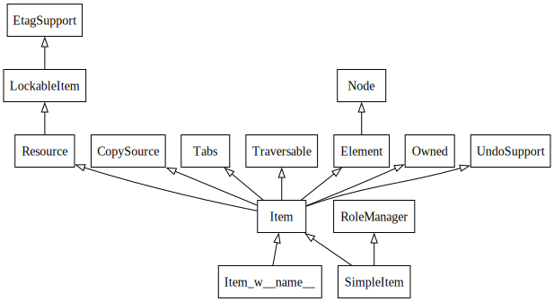
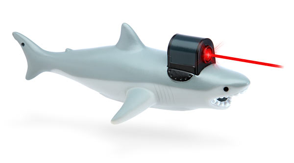
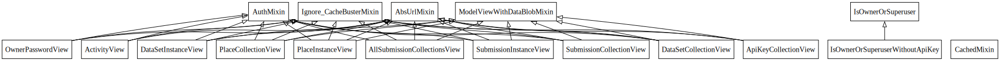

:css: static/style.css

:data-transition-duration: 2400

.. title:: incremental non-design

=========================
Incremental (non-) Design
=========================

 .. image:: static/cute-collapsing-towers-animation.gif 

Paul Winkler
@bitly
10/28/2013

 

----

Intro / Disclaimer
=====================

.. note::

  There's some fairly beginner-level OO design tips here.
  Some of you know all of this. Some of you know more than me about all of
  this.  Some of you may disagree with me about all of this.  Some of you have
  probably never heard any of this and may learn something. Wanted to share
  my observations and opinions and hopefully we'll all (including me) learn
  something.
  Also, hope that other people will do tech talks during these meetings.
  Also, MORE BITLY INTERNAL PRESENTATIONS IN GENERAL

----

Thesis
------

Inheritance is powerful but easily overused.

Inheritance, overused, is bad design with real negative consequences.

Inheritance overuse is easy to do without intention.
(In fact, almost inevitable.)

We all do it, let's think about it and stop.

----

Backstory
============

Last month: Working on Audience Analysis endpoints.

Needed to add and endpoint, and reuse some existing features.

Solution: Factored out methods into a new shared base class
(actually a mixin).

There were already other base classes, some shared and some not.
Factored out shared features into two mixins.

.. note::
  does everybody know what a mixin is? in python?

----

Problem solved! Go home.
========================

.. image:: static/problem_solved.gif
   :width: 800px

----

.. image:: static/aa_start.dot.svg

----

.. image:: static/aa_final.dot.svg

----

.. image:: static/tweet.png

https://twitter.com/slinkp23/status/382568693466935296

----

Confessions of a Recovering Zope Programmer
============================================

Perhaps this makes me overly sensitive?

----

So I should know better.

----

My Worst Practice: Incremental Non-Design
-------------------------------------------

Default OO design: big inheritance chain.
(Single or multiple.)

Default refactoring:  Make moar base classes.

Result: Big complex inheritance graph grows and grows.

It's not just me.

----

What should we do instead?

----

"Favor Composition Over Inheritance"
------------------------------------

"Has-a" or "Uses-a" relationships, instead of "Is-a".

Underlying principle in "Design Patterns" (aka the "Gang of Four" book)

----

BUT WHY?
========

----

Symptoms of Inheritance Overuse
--------------------------------

* Class Explosion

* "Yo-yo" problem

* Poor Separation of Concerns

Let's see these by example.

----

Contrived Example:
------------------

.. code:: python

    shark_with_lasers.attack(target)

.. image:: static/shark-stealing-a-camera-lasers_01.jpg
   :width: 400px

----

Bad implementation
--------------------
.. code:: python

    class SharkWithLasers(Shark, LaserMixin):
    
        def attack(self, target):
            self.shoot(target)
            self.eat(target)

.. image:: static/shark_inherit_1.py.dot.svg
   :width: 400px

----

This is easy, right?

But now we want an orca with nunchaku.

----

.. image:: static/shark_inherit_1a.py.dot.svg
   :width: 1000px

----

.. image:: static/shark_inherit_2.py.dot.svg
   :width: 1000px

----

And now we want to allow them to wear armor.

----

.. image:: static/shark_inherit_3.py.dot.svg

----

.. :data-rotate: 180

:data-x: r0
:data-y: 2500
:data-z: 4000
:data-rotate-x: 90
:data-rotate-z: 90

Class explosion.
================

----

:data-rotate: 0
:data-x: r0
:data-y: r0
:data-z: 0
:data-rotate-x: 180
:data-rotate-z: 180

Every concept we add makes more and more classes.

But even if we never do, it's already bad, because...

----

:data-rotate: 0
:data-x: r2000
:data-y: r2000
:data-z: r0
:data-rotate-x: 0
:data-rotate-z: 0

Yo-yo problem
===============

:data-y: r0

https://en.wikipedia.org/wiki/Yo-yo_problem

  "Often we get the feeling of riding a yoyo when we
  try to understand one these [sic] message trees."
  -- Taenzer, Ganti, and Podar, 1989

.. note::

  The source of an attribute or method is implicit.
  When self.foo() calls self.bar() calls self.baz() calls self.fleem()
  and each of those could be defined in any or all of 20 inherited classes.
  Only the method name gives a clue; "self" is useless.
  Put another way: when you see "self", you don't know if it's shark, or a
  base Animal, or a thing with lasers, or a base Weapon, or a thing with armor? You have to look all over, with only the names to give you clues.

----

:data-y: r1000
:data-x: r0

Yo-yo problem larval stage
===========================

.. code:: python

    class SharkWithLasers(SharkBase, LaserMixin):

        def attack(self, target):
            self.shoot(target)
            self.eat(target)

Where are shoot() and eat() defined?
-------------------------------------

----

:data-y: r-2000
:data-x: r0

Okay, easy in that example.

.. code:: python
    
    class Shark(object):
        def eat(self, target):
            print "chomp! delicious %s" % target
    
    class LaserMixin(object):
        def shoot(self, target):
            print "pew! pew! at %s" % target

Not so much when there are dozens of classes.

----

:data-y: r3000
:data-x: r0

Imagine that:

- you don't have the diagram, just code.

- methods are overriden in various places throughout this graph

- Who is "self"?

----

:data-y: r-4000
:data-x: r0

Single inheritance is somewhat easier...
========================================

.. note::

  Your poor brain only has to bounce up and down in the class chain,
  not all over a class graph.

But it's still bad.

----

:data-y: r5000
:data-x: r0

Poor Separation of Concerns
=============================

ArmoredSharkWithLasers will have methods related to sharks, lasers, and armor.

Those are not conceptually related at all.

More classes + more methods = more yo-yo

----

:data-y: r-6000
:data-x: r2000

But that's all contrived!
===========================

Yes, it's a bad made-up design that nobody would ever do.

(right?)

----

:data-y: r0
:data-x: r2000

Overuse of Inheritance & Mixins - Examples in the Wild
==========================================================

 - Zope 2 - OFS.Item
 - Django "Generic" views
 - DjangoRestFramework - old version
 - a bunch of things I wrote, eg. OpenBlock scraper mini-framework

----

----

None of this is news.  Why do we all still overuse inheritance?
---------------------------------------------------------------

- OO 101: Falls out of any language with inheritance

- D.R.Y. encourages quick easy refactoring

- Reuse via adding more base classes is almost always
  obvious and easy.

- Alternatives may not be as intuitive or obvious.

- Once you pop, you can't stop

----

.. Possibly Controversial Opinion: Mixins are bad more often than good.
.. --------------------------------------------------------------------

.. ----

.. Mixins are good...
.. --------------------

..  - mixins are good because each base class does one thing
..  - convenient because you can combine these base classes to get
..    different combinations of behavior.

.. ----

.. BUT mixins are bad...
.. ------------------------

..  - multiple inheritance gone bananas.
..  - easy to assemble lego-style iff you understand the classes
..    and how they interact.
..  - very hard to understand if you don't.
..  - very hard to debug a concrete class made by someone else, or by yourself last month
..    - python 2.5 does not give us tools to talk about contracts, so you really have to read every line to understand what the implicit contract is. What can I mix this into?

.. ----

Composition: Usually Better
------------------------------

.. code:: python

    class Shark(object):
        def __init__(self, weapon):
            self.weapon = weapon

        def eat(self, target):
            print "chomp! delicious %s" % target

        def attack(self, target):
            self.weapon.attack(target)
            self.eat(target)

    shark_with_laser = Shark(weapon=Laser())

----

Better: Fewer Classes
---------------------

.. image:: static/shark_composition_3.py.dot.svg

----

Better:  Separation of Concerns, and Less Yo-yo Problem
---------------------------------------------------------

- "self.weapon" namespace is a nice bundling of related functionality

.. code:: python

        def attack(self, target):
            self.weapon.attack(target)
            #    ^^^^^^  A clue!
            self.eat(target)
            # Still have to look, but the tree is smaller.

.. note::

  - If needed, one-line wrapper methods can be added to Shark or a subclass, and these internally are nice and explicit. (Be mindful of the "law of demeter")

----

Better: More expressive too
----------------------------

These would have been hard to do without special case hacks
and/or yet more classes:
 
.. code:: python

    mystery_shark = Shark(
        weapon=get_random_weapon_somehow())

    armed_to_the_teeth = Shark(
        weapon=WeaponCollection(Lasers(), Grenades()))

----

Where do we overuse inheritance at Bitly?
-------------------------------------------

I've most often seen it in tornado.web.Handler subclasses.

Not nearly as pathological, but still gets a bit rough.

----

Aside: Mixins not always bad
------------------------------

eg. libbitly.ArgumentMixin

 - provides some common special handling of getting args
 - not really useful outside a Handler class, so, okay that it expects to be mixed in to a Handler
 - does only a couple closely related things
 - unlikely to need to use it polymorphically / override its methods

----

Back to the backstory...
=========================

Audience Analysis:

Two different handlers need to show click rates.

 - I would prefer them to *have* a ClickRateFetcher, not *be* a
   ClickRateFetcher, since that's orthogonal to serving a request.

 - but I need to get the info from Clickatron...

 - clickatron is accessed via ClickatronProxy which depends on being
   mixed in to a Handler

----

Choices:

   1. write my own Clickatron client (ugh)

   2. or ClickRateFetcher and the Handler can refer to and call each other

   3. or suck it up and put the ClickRateFetcher in the inheritance graph

----

Untangling is hard
===================

.. code:: python

    class ClickatronProxy(object):
        """
        Mixin class for querying clickatron in conjunction
        with GenericMetricsHandler properties
        """

Why does a clickatron client need to *be* a request handler anyway?

Maybe it doesn't.  Or shouldn't.

But it calls various methods and properties of other base Handler classes, so
there's a lot of inertia.

.. note::

  So existing inheritance hierarchy tends to encourage more inheritance,
  because it's easier than puzzling out how to do without it.

  Next time I'll try the reference.

----

Discussion? Q&A?
=================

References / Inspiration / Shamelessly Stolen
---------------------------------------------

* "End of Object Inheritance" talk, PyCon 2013
  - Video http://pyvideo.org/video/1684/
  - slides unfortunately not readable alone, really should watch it.

* "API Design for Library Authors" - Chris McDonough's talk @ PyCon 2013
  - Video http://pyvideo.org/video/1705/api-design-for-library-authors
  - Slides https://speakerdeck.com/pyconslides/api-design-for-libraries-by-chris-mcdonough
  - Relevant takeaway: Don't make your users inherit from your classes.
  - introduced me to "yoyo problem".

* "Composability Through Multiple Inheritance" - opposing view, also PyCon 2013. https://us.pycon.org/2013/schedule/presentation/110/

